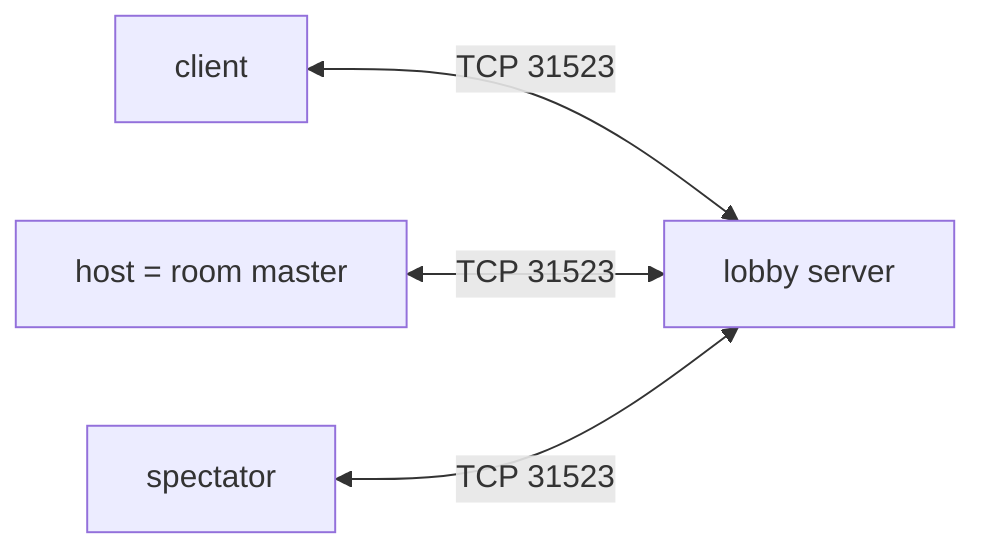
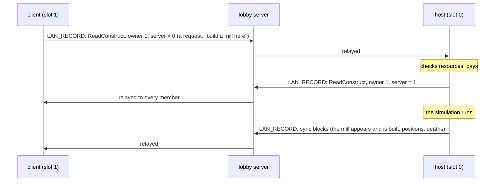
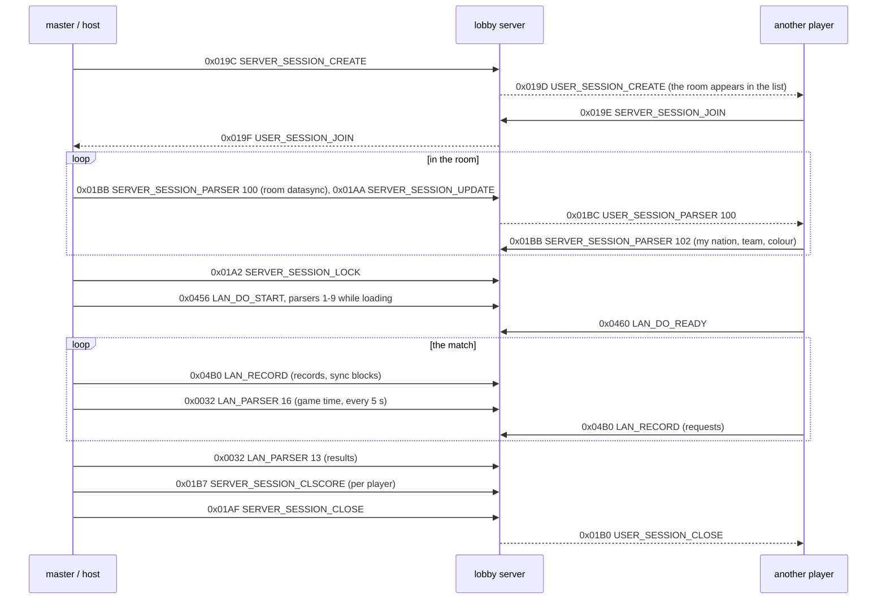
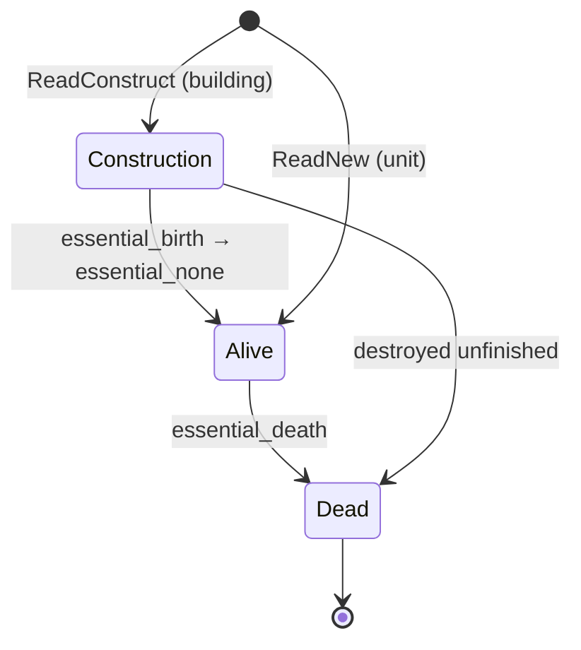

# Cossacks 3 Network Protocol and Match Stream

| | |
|---|---|
| Revision | 0.4, 2026-09-29 |
| Game version | 2.2.3 (core 1.0.0.7), unmodded scripts (room checksum `3EEB`) |
| Status | Reverse-engineered; checked on recorded matches |
| Reference implementation | [`c3net`](c3net/) (Python, this repository) |

This document describes everything Cossacks 3 exchanges with its lobby server:

- **the lobby frame** and every message code;
- **the parsers**, the game's own key/value messages inside rooms and matches;
- **the match stream**, in which the game host sends the state of a match to
  the other players.

With it, a lobby server can follow a match as it happens: units trained and
lost, buildings placed and finished, upgrades, resources, positions, fights
and the result, with no mod on the players' side.

Not affiliated with GSC Game World. No game files are included here. The
layouts were read from the game's own script handlers (the `Write*` / `Read*`
sections of its `.aix` state machines, the `dmscript.global` constants) and
from [Sich](https://github.com/3skcassoc/sich), an open lobby server. They
were checked against recorded matches.

## Contents

- [1. Introduction](#1-introduction)
  - [1.1 Scope](#11-scope) · [1.2 Verification](#12-verification) · [1.3 Conventions](#13-conventions) · [1.4 Terms](#14-terms)
- [2. Architecture](#2-architecture)
- [3. Data types](#3-data-types)
- [4. Lobby frame](#4-lobby-frame)
  - [4.1 Frame construction](#41-frame-construction) · [4.2 Addresses](#42-addresses) · [4.3 Message codes](#43-message-codes) · [4.4 Flow of a match](#44-flow-of-a-match)
- [5. Lobby messages](#5-lobby-messages)
  - [5.1 Connection and accounts](#51-connection-and-accounts) · [5.2 Chat](#52-chat) · [5.3 Rooms](#53-rooms) · [5.4 In-room game messages](#54-in-room-game-messages) · [5.5 Enumerations](#55-enumerations)
- [6. Parsers](#6-parsers)
  - [6.1 Tree encoding](#61-tree-encoding) · [6.2 Parser ids](#62-parser-ids) · [6.3 Parser definitions](#63-parser-definitions)
- [7. Room data](#7-room-data)
  - [7.1 Game name](#71-game-name) · [7.2 Lobby status](#72-lobby-status) · [7.3 Teams](#73-teams) · [7.4 Result codes](#74-result-codes)
- [8. The match stream (`0x04B0 LAN_RECORD`)](#8-the-match-stream-0x04b0-lan_record)
  - [8.1 Block construction](#81-block-construction) · [8.2 Owners](#82-owners) · [8.3 Record types](#83-record-types) · [8.4 Body values](#84-body-values) · [8.5 Progress records](#85-progress-records) · [8.6 Player records](#86-player-records) · [8.7 Sync block](#87-sync-block) · [8.8 Decoding robustly](#88-decoding-robustly) · [8.9 GUI records](#89-gui-records)
- [9. What the data means](#9-what-the-data-means)
- [10. QLREC1 recordings](#10-qlrec1-recordings)
- [11. Enumerations](#11-enumerations)
- [Appendix A. Annotated examples](#appendix-a-annotated-examples)
- [Appendix B. Reference implementation](#appendix-b-reference-implementation)
- [Appendix C. Revision history](#appendix-c-revision-history)

---

## 1. Introduction

### 1.1 Scope

Covered:

- the lobby frame, every message code, and the payload of every message the
  reference lobby server parses;
- the parsers: the game's key/value messages, and the ones that carry room
  state, results and game time;
- room data: the game name, the lobby status string, the room datasync;
- the match stream: its signature bytes, its two block types and the layout
  of every record;
- what the values mean, including traps in the game's own statistics;
- the random map: the random numbers its generator draws, how the seed
  picks the terrain mask, the starting points and the patterns, the
  heights, and how to recover the seed of a match that never sent it (9.10).

Not covered:

- the payloads of the social messages (friends, chats, clans, members,
  admins, stats: codes `0x01C2`–`0x01DF`). They are listed, but their layout
  is not documented.
- saved games and historical battles;
- the map generator's scripts themselves: they are the game's. 9.10
  describes how the seed drives them, the pattern file and a height
  model.

### 1.2 Verification

- **Record layouts** (section 8) come from the handler that reads each
  record in the game's scripts. On recorded 2.2.3 matches, every block
  decodes and every record ends exactly on its end byte.
- **Statistics** (section 9) were compared with the game's end screen and
  balance to the unit once 9.4 is applied.
- **Lobby payloads** (section 5) follow Sich, which serves the game.
- **Two humans:** checked on a match of two players (and two computers):
  the client's requests to the host (8.3), parser 16 (6.3.3), parser 1
  (6.3.5) and a lobby server's pause (8.9).
- **The random map** (9.10): maps generated from the seed were compared
  with the host's first snapshot. On a two-human match, whose seed came in
  parser 1, 99.7 % of the generated objects match. On a one-human match,
  whose seed was recovered, 99.1 % match.

### 1.3 Conventions

- Integers are **little-endian**. Floats are IEEE 754.
- Payloads are shown as C structs. The types are those of section 3. `[]`
  is a list whose length is given in the comment. Fields that are only
  present sometimes say when.
- `0x` numbers are hexadecimal. "Bit *n*" counts from 0, the least
  significant bit.
- Field names in `snake_case` are this document's. Names in `CamelCase` or
  with a `gc_` / `g` prefix are the game's own. Message names are Sich's.

> [!NOTE]
> Notes give context.

> [!WARNING]
> Warnings mark behaviour that is easy to get wrong.

### 1.4 Terms

| Term | Meaning |
|---|---|
| Lobby server | Where the game logs in and finds rooms. The original is gone; Sich is a compatible open implementation. |
| Client | The game program of one player (or spectator). |
| Room / session | A game lobby that becomes a match. Its creator is the **master**. |
| Host | The master, once the match starts: it runs the simulation. |
| Id | A player's lobby account number (the game's `lanid`). |
| Slot | A player's place in the room, 0–11 (`gMap.players[slot]`). |
| Machine | A script state machine (`.aix` file). Every slot has a *global* machine; there is one *progress* machine. |
| Section | A named block of script in a machine. Records name it by its index. |
| Record | One message of the match stream: "run this section of this machine with this data". |
| Sync block | The engine's own message with unit states and positions. |
| uid | A game object's unique id: units, buildings, fields, trees. |

---

## 2. Architecture



- The game connects to the lobby server named in
  `data/resources/servers.dat`: `* = host:port`, port 31523.
- There is **no peer-to-peer traffic**. Inside a room, every message goes to
  the lobby server, which relays it to the other members.
- **The game is host-authoritative, not lockstep:**



The lobby server therefore sees the whole match, as the host decided it.

---

## 3. Data types

### 3.1 Lobby payload types

| Type | Size | Sich code | Encoding |
|---|---|---|---|
| `uint8_t` | 1 | `1` | unsigned byte |
| `bool8_t` | 1 | `b` | 0 = false, anything else = true |
| `uint16_t` | 2 | `2` | unsigned |
| `uint32_t` / `int32_t` | 4 | `4` | unsigned / two's complement |
| `str8_t` | 1 + n | `s` | `uint8_t n`, then n bytes |
| `str16_t` | 2 + n | `w` | `uint16_t n`, then n bytes |
| `str32_t` | 4 + n | `z` | `uint32_t n`, then n bytes |
| `version_t` | 1 + n | `v` | `str8_t` such as `"1.0.0.7"`; Sich packs it as one byte per part: `0x01000007` |
| `datetime_t` | 8 | `d`, `t` | IEEE double: days since 1899-12-30 (Delphi `TDateTime`); `unix = (d − 25569) × 86400` |
| `parser_t` | ≥ 12 | `p` | a parser tree (6.1) |
| `sized_parser_t` | 4 + n | `q` | `str32_t` whose bytes are a `parser_t` |

> [!NOTE]
> Text (nicknames, room names, chat) is what the player typed: Windows-1251
> or UTF-8, depending on the client. Decode as UTF-8 and fall back to
> Windows-1251.

### 3.2 Match stream body types

Record bodies (8.4) use the game's `RecordCustomWrite*` / `RecordCustomRead*`:

| Game type | C type here | Size |
|---|---|---|
| `Boolean` | `bool8_t` | 1 |
| `Byte` | `uint8_t` | 1 |
| `Word` | `uint16_t` | 2 |
| `Integer` | `int32_t` | 4 |
| `Float` | `float` | 4 |
| `String` | `str16_t` | 2 + n; object codes are ASCII |

A **uid list** is `int32_t count; int32_t uid[count];`.

---

## 4. Lobby frame

### 4.1 Frame construction

Every message, in both directions, is one frame:

```
Payload length ~~~ Message code ~~~ Sender id ~~~ Recipient id ~~~ Payload
```

```cpp
struct frame_header      // 14 bytes, then the payload
{
    uint32_t length;     // payload bytes, not counting this header
    uint16_t code;       // message code, 4.3
    uint32_t id_from;    // sender's id; 0 = the server, or a client not yet logged in
    uint32_t id_to;      // recipient's id; 0 = the server, or everyone in the room
};
```

- There is no sync byte and no checksum; TCP keeps frames aligned.
- A reader takes the 14-byte header, then exactly `length` bytes.

> [!WARNING]
> The protocol is not encrypted, and passwords are not hashed.
> `SERVER_REGISTER`, `SERVER_AUTHENTICATE` and `SERVER_UPDATE_INFO` carry the
> e-mail and the password in clear text. A server must not log their
> payloads. Players should not reuse a password from elsewhere.

### 4.2 Addresses

| `id_from` / `id_to` | Meaning |
|---|---|
| `0` | the lobby server; as a recipient in a room: every other member |
| `1` … | a player's lobby id, assigned at registration |

The server fills `id_from` of `USER_*` messages with the id they concern.
For example, the id of the player who connected in `USER_CONNECTED`.

### 4.3 Message codes

Directions:

- **C→S** — client to server, a request (`SERVER_*` names);
- **S→C** — server to client (`USER_*` names);
- **C↔C** — relayed between room members (`LAN_*` names).

| Code | Name | Dir | Purpose | Payload |
|---|---|---|---|---|
| `0x0032` | `LAN_PARSER` | C↔C | a parser inside a match | [5.4](#0x0032-lan_parser) |
| `0x0064` | `LAN_CLIENT_INFO` | C↔C | a client's info (LAN mode) | [5.4](#0x0064-lan_client_info) |
| `0x00C8` | `LAN_SERVER_INFO` | C↔C | the game's info (LAN mode) | [5.4](#0x00c8-lan_server_info) |
| `0x0190` | `SHELL_CONSOLE` | | | — |
| `0x0191` | `PING` | C→S, S→C | round trip time | [5.1](#0x0191-ping) |
| `0x0192` | `SERVER_CLIENTINFO` | C→S | ask for a player's info | [5.1](#0x0192-server_clientinfo) |
| `0x0193` | `USER_CLIENTINFO` | S→C | a player's info | [5.1](#0x0193-user_clientinfo) |
| `0x0194` | `SERVER_SESSION_MSG` | C→S | room chat | [5.2](#0x0194-server_session_msg--0x0195-user_session_msg) |
| `0x0195` | `USER_SESSION_MSG` | S→C | room chat | [5.2](#0x0194-server_session_msg--0x0195-user_session_msg) |
| `0x0196` | `SERVER_MESSAGE` | C→S | private message | [5.2](#0x0196-server_message--0x0197-user_message) |
| `0x0197` | `USER_MESSAGE` | S→C | private message | [5.2](#0x0196-server_message--0x0197-user_message) |
| `0x0198` | `SERVER_REGISTER` | C→S | create an account and log in | [5.1](#0x0198-server_register) |
| `0x0199` | `USER_REGISTER` | S→C | result, and the lobby | [5.1](#0x0199-user_register--0x019b-user_authenticate) |
| `0x019A` | `SERVER_AUTHENTICATE` | C→S | log in | [5.1](#0x019a-server_authenticate) |
| `0x019B` | `USER_AUTHENTICATE` | S→C | result, and the lobby | [5.1](#0x0199-user_register--0x019b-user_authenticate) |
| `0x019C` | `SERVER_SESSION_CREATE` | C→S | create a room | [5.3](#0x019c-server_session_create) |
| `0x019D` | `USER_SESSION_CREATE` | S→C | a room was created | [5.3](#0x019d-user_session_create) |
| `0x019E` | `SERVER_SESSION_JOIN` | C→S | join a room | [5.3](#0x019e-server_session_join) |
| `0x019F` | `USER_SESSION_JOIN` | S→C | a player joined | [5.3](#0x019f-user_session_join) |
| `0x01A0` | `SERVER_SESSION_LEAVE` | C→S | leave the room | empty |
| `0x01A1` | `USER_SESSION_LEAVE` | S→C | a player left | [5.3](#0x01a1-user_session_leave) |
| `0x01A2` | `SERVER_SESSION_LOCK` | C→S | the master starts the match | [5.3](#0x01a2-server_session_lock) |
| `0x01A3` | `USER_SESSION_LOCK` | S→C | a room started | [5.3](#0x01a3-user_session_lock) |
| `0x01A4` | `SERVER_SESSION_INFO` | C→S | ask for the room | empty |
| `0x01A5` | `USER_SESSION_INFO` | S→C | a room's info | [5.3](#0x01a5-user_session_info) |
| `0x01A6` | `USER_CONNECTED` | S→C | a player came online | [5.1](#0x01a6-user_connected--0x01b4-user_update_info) |
| `0x01A7` | `USER_DISCONNECTED` | S→C | a player went offline | empty; `id_from` = the player |
| `0x01A8` | `SERVER_USER_EXIST` | C→S | is this e-mail registered? | [5.1](#0x01a8-server_user_exist) |
| `0x01A9` | `USER_USER_EXIST` | S→C | answer | [5.1](#0x01a9-user_user_exist) |
| `0x01AA` | `SERVER_SESSION_UPDATE` | C→S | the room's lobby entry changed | [5.3](#0x01aa-server_session_update) |
| `0x01AB` | `SERVER_SESSION_CLIENT_UPDATE` | C→S | a player's lobby team | [5.3](#0x01ab-server_session_client_update--0x01ac-user_session_client_update) |
| `0x01AC` | `USER_SESSION_CLIENT_UPDATE` | S→C | a player's lobby team | [5.3](#0x01ab-server_session_client_update--0x01ac-user_session_client_update) |
| `0x01AD` | `SERVER_VERSION_INFO` | C→S | the client's data version | [5.1](#0x01ad-server_version_info) |
| `0x01AE` | `USER_VERSION_INFO` | S→C | the server's versions and settings | [5.1](#0x01ae-user_version_info) |
| `0x01AF` | `SERVER_SESSION_CLOSE` | C→S | the host ends the match | empty |
| `0x01B0` | `USER_SESSION_CLOSE` | S→C | a room closed | [5.3](#0x01b0-user_session_close) |
| `0x01B1` | `SERVER_GET_TOP_USERS` | C→S | ask for the top list | [5.1](#0x01b1-server_get_top_users) |
| `0x01B2` | `USER_GET_TOP_USERS` | S→C | the top list | [5.1](#0x01b2-user_get_top_users) |
| `0x01B3` | `SERVER_UPDATE_INFO` | C→S | change password / nickname / country | [5.1](#0x01b3-server_update_info) |
| `0x01B4` | `USER_UPDATE_INFO` | S→C | a player's info changed | [5.1](#0x01a6-user_connected--0x01b4-user_update_info) |
| `0x01B5` | `SERVER_SESSION_KICK` | C→S | the master kicks a player | [5.3](#0x01b5-server_session_kick--0x01b6-user_session_kick) |
| `0x01B6` | `USER_SESSION_KICK` | S→C | a player was kicked | [5.3](#0x01b5-server_session_kick--0x01b6-user_session_kick) |
| `0x01B7` | `SERVER_SESSION_CLSCORE` | C→S | the host reports a player's result | [5.3](#0x01b7-server_session_clscore--0x01b8-user_session_clscore) |
| `0x01B8` | `USER_SESSION_CLSCORE` | S→C | | [5.3](#0x01b7-server_session_clscore--0x01b8-user_session_clscore) |
| `0x01B9` | `SERVER_FORGOT_PSW` | C→S | password reminder | [5.1](#0x01b9-server_forgot_psw) |
| `0x01BA` | `SERVER_SESSION_WRONG_CLOSE` | C→S | | — |
| `0x01BB` | `SERVER_SESSION_PARSER` | C→S | a parser to a room member, or to the whole room | [5.3](#0x01bb-server_session_parser) |
| `0x01BC` | `USER_SESSION_PARSER` | S→C | the same parser, delivered | [5.3](#0x01bc-user_session_parser) |
| `0x01BD` | `USER_SESSION_RECREATE` | S→C | recreate the room after the host left | [5.3](#0x01bd-user_session_recreate) |
| `0x01BE` | `USER_SESSION_REJOIN` | S→C | rejoin | empty |
| `0x01BF` | `SERVER_PING_TEST` | | | — |
| `0x01C0` | `USER_PING_TEST` | | | — |
| `0x01C1` | `SERVER_SESSION_REJOIN` | C→S | | — |
| `0x01C2`–`0x01C5` | `*_FRIENDS` | | friends | not documented |
| `0x01C6`–`0x01CA` | `*_CHATS` | | chat channels | not documented |
| `0x01CB`–`0x01CF` | `*_CLANS` | | clans | not documented |
| `0x01D0`–`0x01D3` | `*_MEMBERS` | | clan members | not documented |
| `0x01D4`–`0x01DB` | `*_ADMINS` | | moderation | not documented |
| `0x01DC`–`0x01DF` | `*_STATS` | | statistics | not documented |
| `0x01E0` | `SERVER_GET_SESSIONS` | C→S | ask for the room list | empty |
| `0x01E1` | `USER_GET_SESSIONS` | S→C | the room list | [5.3](#0x01e1-user_get_sessions) |
| `0x01E2` | `SERVER_PING_LOCK` | C→S | | empty |
| `0x01E3` | `SERVER_PING_UNLOCK` | C→S | | empty |
| `0x01E4` | `SERVER_CHECKSUM` | C→S | the client's checksum | [5.1](#0x01e4-server_checksum) |
| `0x01E5` | `USER_CHECKSUM` | S→C | | empty |
| `0x01E6` | `USER_CHECKSUM_FAILED` | S→C | | — |
| `0x0456` | `LAN_DO_START` | C↔C | the master starts loading | [5.4](#0x0456-lan_do_start--0x0457-lan_do_start_game--0x0460-lan_do_ready--0x0461-lan_do_ready_done) |
| `0x0457` | `LAN_DO_START_GAME` | C↔C | | [5.4](#0x0456-lan_do_start--0x0457-lan_do_start_game--0x0460-lan_do_ready--0x0461-lan_do_ready_done) |
| `0x0460` | `LAN_DO_READY` | C↔C | a client has loaded | [5.4](#0x0456-lan_do_start--0x0457-lan_do_start_game--0x0460-lan_do_ready--0x0461-lan_do_ready_done) |
| `0x0461` | `LAN_DO_READY_DONE` | C↔C | everyone has loaded | [5.4](#0x0456-lan_do_start--0x0457-lan_do_start_game--0x0460-lan_do_ready--0x0461-lan_do_ready_done) |
| `0x04B0` | `LAN_RECORD` | C↔C | **the match stream** | [section 8](#8-the-match-stream-0x04b0-lan_record) |

### 4.4 Flow of a match



---

## 5. Lobby messages

### 5.1 Connection and accounts

#### 0x0191 PING

```cpp
// C→S (id_from != 0)
datetime_t pingtime;          // the client's clock

// S→C (id_from == 0)
uint32_t count;
struct { uint32_t id; datetime_t pingtime; } clients[count];
```

#### 0x0192 SERVER_CLIENTINFO

```cpp
uint32_t id;                  // whose info
```

#### 0x0193 USER_CLIENTINFO

```cpp
uint32_t   id;
uint8_t    states;            // 5.5.1
str8_t     nickname;
str8_t     country;
uint32_t   score;
uint32_t   games_played;
uint32_t   games_win;
datetime_t last_game;
str8_t     info;              // free-form text the client registered with
datetime_t pingtime;          // data version 2.1.0 and later
```

#### 0x0198 SERVER_REGISTER

```cpp
version_t vcore;              // "1.0.0.7"
version_t vdata;              // "2.2.3"
str8_t    email;
str8_t    password;           // clear text!
str8_t    cdkey;
str8_t    nickname;
str8_t    country;
str8_t    info;
```

#### 0x019A SERVER_AUTHENTICATE

```cpp
version_t vcore;
version_t vdata;
str8_t    email;
str8_t    password;           // clear text!
str8_t    cdkey;
```

#### 0x0199 USER_REGISTER / 0x019B USER_AUTHENTICATE

```cpp
uint8_t error;                // 5.5.2; 0 = logged in, and the rest follows
str8_t     nickname;
str8_t     country;
uint32_t   score;
uint32_t   games_played;
uint32_t   games_win;
datetime_t last_game;
str8_t     info;

// the players online, until an id of 0
struct {
    uint32_t   id;            // 0 ends the list
    uint8_t    states;
    str8_t     nickname;
    str8_t     country;
    str8_t     info;
    uint32_t   score;         // this and the rest: data version 2.1.0 and later
    uint32_t   games_played;
    uint32_t   games_win;
    datetime_t last_game;
    datetime_t pingtime;
} clients[];

// the rooms, until a master id of 0
struct {
    uint32_t master_id;       // 0 ends the list
    uint32_t max_players;
    str8_t   gamename;        // 7.1
    str8_t   mapname;         // 7.2
    uint32_t money;
    bool8_t  fog_of_war;
    uint8_t  battlefield;
    uint32_t count;
    uint32_t id[count];       // the players in it
} sessions[];
```

#### 0x01A6 USER_CONNECTED / 0x01B4 USER_UPDATE_INFO

`id_from` is the player.

```cpp
str8_t     nickname;
str8_t     country;
str8_t     info;
uint8_t    states;
uint32_t   score;             // this and the rest: data version 2.1.0 and later
uint32_t   games_played;
uint32_t   games_win;
datetime_t last_game;
datetime_t pingtime;
```

#### 0x01A8 SERVER_USER_EXIST

```cpp
str8_t email;
```

#### 0x01A9 USER_USER_EXIST

```cpp
str8_t  email;
bool8_t exist;
```

#### 0x01AD SERVER_VERSION_INFO

```cpp
version_t vdata;
```

#### 0x01AE USER_VERSION_INFO

```cpp
version_t      vcore;
version_t      vdata;
sized_parser_t parser;        // Sich sends an empty one
```

#### 0x01B1 SERVER_GET_TOP_USERS

```cpp
uint32_t count;               // how many
```

#### 0x01B2 USER_GET_TOP_USERS

```cpp
struct {
    uint8_t    mark;          // 0 ends the list; 2 = the id follows (data 1.3.6 and later)
    str8_t     nickname;
    str8_t     country;
    uint32_t   score;
    uint32_t   games_played;
    uint32_t   games_win;
    datetime_t last_game;
    uint32_t   id;            // if mark >= 2
} users[];
```

#### 0x01B3 SERVER_UPDATE_INFO

```cpp
str8_t password;              // the new password, clear text
str8_t nickname;
str8_t country;
str8_t info;
```

#### 0x01B9 SERVER_FORGOT_PSW

```cpp
str8_t email;
```

#### 0x01E4 SERVER_CHECKSUM

```cpp
str16_t checksum;
```

### 5.2 Chat

#### 0x0194 SERVER_SESSION_MSG / 0x0195 USER_SESSION_MSG

Room chat: to everyone in the room. It is also used in the match.

```cpp
str8_t message;
```

#### 0x0196 SERVER_MESSAGE / 0x0197 USER_MESSAGE

A private message to `id_to`.

```cpp
str8_t message;
```

### 5.3 Rooms

#### 0x019C SERVER_SESSION_CREATE

```cpp
uint32_t max_players;
str8_t   password;            // "" = open
str8_t   gamename;            // 7.1
str8_t   mapname;             // 7.2; "0" at creation
uint32_t money;
bool8_t  fog_of_war;
uint8_t  battlefield;
```

#### 0x019D USER_SESSION_CREATE

`id_from` is the master.

```cpp
uint8_t  states;
uint32_t max_players;
str8_t   gamename;
str8_t   mapname;
uint32_t money;
bool8_t  fog_of_war;
uint8_t  battlefield;
```

#### 0x019E SERVER_SESSION_JOIN

```cpp
uint32_t master_id;           // the room to join
```

#### 0x019F USER_SESSION_JOIN

```cpp
uint32_t master_id;
uint8_t  states;              // of the player who joined (id_from)
```

#### 0x01A1 USER_SESSION_LEAVE

`id_from` is the player who left.

```cpp
bool8_t  is_master;           // the master left
uint32_t count;
struct { uint32_t id; uint8_t states; } clients[count];   // is_master: every member; else the one who left
```

When the master leaves a started room, the server picks a new master and
sends it `USER_SESSION_RECREATE`.

#### 0x01A2 SERVER_SESSION_LOCK

The master starts the match.

```cpp
uint32_t count;
struct {
    uint32_t id;
    uint8_t  team;            // the lobby team: a placeholder in regular rooms (7.3)
} clients[count];
```

#### 0x01A3 USER_SESSION_LOCK

```cpp
uint32_t count;
struct {
    uint32_t id;              // if 0: a session_id follows instead of states
    uint8_t  states;          // if id != 0
    uint32_t session_id;      // if id == 0
} entries[count];
```

#### 0x01A5 USER_SESSION_INFO

```cpp
uint32_t max_players;
str8_t   gamename;
str8_t   mapname;
uint32_t money;
bool8_t  fog_of_war;
uint8_t  battlefield;
uint32_t count;
struct { uint32_t id; uint8_t states; } clients[count];
```

#### 0x01AA SERVER_SESSION_UPDATE

The master updates its room's lobby entry, whenever the room changes.

```cpp
str8_t   gamename;            // 7.1
str8_t   mapname;             // 7.2: the room's status, not a map
uint32_t money;
bool8_t  fog_of_war;
uint8_t  battlefield;
```

#### 0x01AB SERVER_SESSION_CLIENT_UPDATE / 0x01AC USER_SESSION_CLIENT_UPDATE

```cpp
uint8_t team;                 // the lobby team (7.3)
```

#### 0x01B0 USER_SESSION_CLOSE

```cpp
datetime_t timestamp;
uint32_t   count;
struct { uint32_t id; uint32_t score; } clients[count];
```

#### 0x01B5 SERVER_SESSION_KICK / 0x01B6 USER_SESSION_KICK

```cpp
uint32_t id;
```

#### 0x01B7 SERVER_SESSION_CLSCORE / 0x01B8 USER_SESSION_CLSCORE

The host, at the end of a match. There is one per human.

```cpp
uint32_t id;
int32_t  score;               // a result code, not points: 7.4
```

#### 0x01BB SERVER_SESSION_PARSER

A parser to one room member (`id_to`), or to the whole room (`id_to` = 0).
The server delivers it as `USER_SESSION_PARSER` with the same ids. The
master sends the room datasync (parser 100) this way.

```cpp
uint32_t parser_id;           // 6.2
parser_t parser;
```

#### 0x01BC USER_SESSION_PARSER

```cpp
uint32_t parser_id;
parser_t parser;
uint32_t unknown;             // Sich sends 0
```

#### 0x01BD USER_SESSION_RECREATE

When the master leaves, the server sends this to the new master (the others
get `USER_SESSION_REJOIN`):

```cpp
sized_parser_t parser;
```

```
(root)
├ gamename   = <game name>
├ mapname    = <lobby status>
├ master     = <new master's id>
├ session    = <session id>
├ clients    = <number of players>
└ clientlist
   ├ * = <id>
   └ * = ...
```

#### 0x01E1 USER_GET_SESSIONS

```cpp
struct { /* as in USER_AUTHENTICATE */ } sessions[];   // until a master id of 0
```

### 5.4 In-room game messages

The server relays these between the room members without reading them.

#### 0x0032 LAN_PARSER

A parser inside a match: section 6.

```cpp
uint32_t parser_id;
parser_t parser;
```

#### 0x0064 LAN_CLIENT_INFO

```cpp
str16_t  player;
str16_t  nickname;
bool8_t  spectator;
uint32_t id;
uint8_t  team;
uint32_t score;
uint8_t  unknown1;
uint8_t  unknown2;
```

#### 0x00C8 LAN_SERVER_INFO

```cpp
str16_t  gamename;
str16_t  mapname;
uint32_t max_players;
uint32_t protocol_version;
str16_t  host;
bool8_t  secured;
uint8_t  battlefield;
bool8_t  fog_of_war;
uint32_t money;
```

#### 0x0456 LAN_DO_START / 0x0457 LAN_DO_START_GAME / 0x0460 LAN_DO_READY / 0x0461 LAN_DO_READY_DONE

The loading handshake. Their payloads carry nothing a match observer needs.

#### 0x04B0 LAN_RECORD

The match stream: [section 8](#8-the-match-stream-0x04b0-lan_record).

### 5.5 Enumerations

#### 5.5.1 Client states

`states` is a bit field:

| Bit | Mask | State |
|---|---|---|
| 0 | `0x01` | online |
| 1 | `0x02` | in a room |
| 2 | `0x04` | room master |
| 3 | `0x08` | playing (the room has started) |

#### 5.5.2 Login errors

| Code | Meaning |
|---|---|
| 0 | OK |
| 1 | e-mail already registered (register) / wrong password or unknown e-mail (login) |
| 2 | account blocked / already logged in |
| 3 | invalid game key |
| 4 | the core version is outdated |
| 5 | the data version is outdated |
| 6 | invalid registration data |

---

## 6. Parsers

The game's scripts talk to each other in rooms with **parsers**: key/value
trees, sent as `LAN_PARSER` (`0x0032`) or `SERVER_SESSION_PARSER`
(`0x01BB`). In the recorded matches, the room datasync (100) came as
`SERVER_SESSION_PARSER` and the results (13) as `LAN_PARSER`.

### 6.1 Tree encoding

```
Key ~~~ Value ~~~ Child count ~~~ Children
```

```cpp
struct parser_node
{
    str32_t  key;
    str32_t  value;              // numbers are decimal text
    uint32_t count;
    struct parser_node children[count];
};
```

The root's key may name the tree (the datasync's root is `tmp`, with value
`"\0"`). An empty payload is an empty tree.

### 6.2 Parser ids

| Id | Name | Sent by | Carries |
|---|---|---|---|
| 1 | `LAN_GENERATE` | host | the map's recipe: [6.3.5](#635-1-lan_generate) |
| 2 | `LAN_READYSTART` | | |
| 3 | `LAN_START` | | |
| 4 | `LAN_ROOM_READY` | | |
| 5 | `LAN_ROOM_START` | | |
| 6 | `LAN_ROOM_CLIENT_CHANGES` | | |
| 7 | `LAN_GAME_READY` | | |
| 8 | `LAN_GAME_ANSWER_READY` | | |
| 9 | `LAN_GAME_START` | | |
| 10 | `LAN_GAME_SURRENDER` | the player | empty: this player surrenders |
| 11 | `LAN_GAME_SURRENDER_CONFIRM` | | |
| 12 | `LAN_GAME_SERVER_LEAVE` | host | empty: the host leaves |
| 13 | `LAN_GAME_SESSION_RESULTS` | host | results: [6.3.2](#632-13-lan_game_session_results) |
| 14 | `LAN_GAME_SYNC_REQUEST` | client | the client lost sync |
| 15 | `LAN_GAME_SYNC_DATA` | | |
| 16 | `LAN_GAME_SYNC_GAMETIME` | host | the game clock: [6.3.3](#633-16-lan_game_sync_gametime) |
| 17 | `LAN_GAME_SYNC_ALIVE` | | |
| 100 | `LAN_ROOM_SERVER_DATASYNC` | master | the whole room: [6.3.1](#631-100-lan_room_server_datasync) |
| 101 | `LAN_ROOM_SERVER_DATACHANGE` | master | |
| 102 | `LAN_ROOM_CLIENT_DATACHANGE` | client | its choices: [6.3.4](#634-102-lan_room_client_datachange) |
| 103 | `LAN_ROOM_CLIENT_LEAVE` | | |
| 200 | `LAN_MODS_MODSYNC_REQUEST` | | mod download |
| 201 | `LAN_MODS_MODSYNC_PARSER` | | |
| 202–206 | `LAN_MODS_CHECKSUM_*` | | mod checksums |
| 300 | `LAN_ADVISER_CLIENT_DATACHANGE` | | |

### 6.3 Parser definitions

#### 6.3.1 100 LAN_ROOM_SERVER_DATASYNC

The master's copy of the room, sent to the whole room at every change as
`SERVER_SESSION_PARSER`. One key under the root:

| Key | Value |
|---|---|
| `s` | the room string below |

```
Slot 0 | … | Slot 11 | Season | Terrain | Relief | Start resources | Mines | Map size | 12 additional settings | Battle | Stage
```

Fields are separated by `|` (`gc_gui_delimiterchar` = 124).

**The 12 slots** are `gMap.players` in order. The position is the slot
number used everywhere else:

| Slot text | Meaning |
|---|---|
| `id,cid,team,color,ready` | a player: lobby id, nation (11.1; 24 and more = random), team (0 = none), colour, ready flag |
| `-difficulty,cid,team,color` | a computer: 4 fields, the first is 0 or negative: difficulty (11.5) |
| `x` | a closed slot |
| `0` | an empty slot |

Spectators hold a slot with nation −2.

**Map generator** (`gMap.settings.gen`):

| # | Field | Values |
|---|---|---|
| 13 | season | 0 summer, 2 winter, 3 desert, −1 random |
| 14 | terrain | 0 land, 1 mediterranean, 2 peninsulas, 3 islands, 4 continents, 5 continent, 6 coast, 7 lakes, 8 rivers, 9 random |
| 15 | relief | 0 plain, 1 hills, 2 mountains, 3 highlands, 4 plateau, 5 random |
| 16 | starting resources | 0 normal, 1 rich, 2 thousands, 3 millions, 4 random |
| 17 | mines | 0 few, 1 medium, 2 many, 3 random |
| 18 | map size | 3 tiny, 0 normal, 1 large (2×), 2 huge (4×) |

**Additional settings** (`gMap.settings.additional`):

| # | Field | Values |
|---|---|---|
| 19 | starting units | 0 default, 1 army, 2 large army, 3 huge army, 4 many peasants, 5 different nations, 6 towers, 7 cannons, 8 cannons and howitzers, 9 18th c. barracks, 10 17th c. barracks, 11 village, 12 log cabins, 13 union |
| 20 | balloons | 0 default, 1 none, 2 with balloons |
| 21 | cannons | 0 default, 1 no cannons, towers and walls, 2 expensive cannons |
| 22 | peace time | 0 none, 1 10 min, 11 15 min, 2 20 min, 3 30 min, 4 45 min, 5 60 min, 6 90 min, 7 2 h, 8 3 h, 9 4 h |
| 23 | 18th century | 0 default, 1 never, 2 from the start |
| 24 | capture | 0 default, 1 no peasants, 2 no peasants and centres, 3 cannons only |
| 25 | market and diplomacy | 0 default, 1 no diplomatic centre, 2 no market, 3 neither, 4 expensive mercenaries |
| 26 | allies | 0 default, 1 side by side |
| 27 | autosave | |
| 28 | population limit | 0 none; 1–8: 500, 750, 1000, 1500, 2200, 3000, 5000, 8000 units |
| 29 | game speed | 0 normal, 1 fast, 2 very fast, −1 adjustable |
| 30 | adviser | 0 default, 1 none |

The last two fields:

- **31 battle:** the historical battle's index; −1 on a random map.
- **32 stage:** the battle's stage.

Example (a 2.2.3 match: one player of England in slot 0 against a computer
in slot 1):

```
1,2,0,0,0|0,24,0,1|0|0|0|0|0|0|x|x|x|0|0|0|3|2|1|0|0|0|0|0|0|0|0|1|0|0|2|1|-1|0
```

The fields read as follows:

- **slot 0:** id 1, England, no team, colour 0;
- **slot 1:** a normal computer with a random nation, colour 1;
- **slots 8–10:** closed;
- **map:** summer, land, highlands, "thousands" of starting resources,
  medium mines, normal size;
- **settings:** allies side by side, very fast speed, no adviser.

#### 6.3.2 13 LAN_GAME_SESSION_RESULTS

Sent by the host when a player's victory state changes, and at the end.
There is one child per participant:

```
(root)
├── * ── id = <lobby id>     0 for a computer player
│      ├ ind = <slot>
│      └ res = <state>      1 win, 2 lose (gc_player_victorystate_*; 0 none)
└── * ── ...
```

A player can lose before the match ends, in a team game.

#### 6.3.3 16 LAN_GAME_SYNC_GAMETIME

The host's game clock, as `LAN_PARSER`. It is sent every 5 s of real time
while the room has more than one human, and when the host changes the game
speed.

| Key | Value |
|---|---|
| `t` | game time, seconds (decimal text) |
| `s` | the time speed factor: 7 normal, 10 fast, 14 very fast (`gc_settings_gamespeed_*`) |

Game time runs at `s / 10` of real time: at 14 ("very fast"), 7 game
seconds pass in 5 real seconds. The first three of a recorded match:

```
t = 1.47273135185242   s = 14
t = 8.52007389068604   s = 14      5.0 s later
t = 15.5319519042969   s = 14      5.0 s later
```

> [!NOTE]
> In a match against computer players only, there is no parser 16. The
> speed is still in the host's `ReadTimeSpeed` (8.9) and the room settings
> (6.3.1, field 29): game time = playing time × speed / 10.

#### 6.3.5 1 LAN_GENERATE

When the room has more than one human, the host sends its whole `gMap`
before the start (`StateMachineGlobalVariablesSaveToParser`): the recipe of
the map, for every client to generate the same one. About 7 KB. The keys
follow the script's `TMap` class:

```
(root: tmp)
├ name, gamestage, lastenvuid, dlcs, brating, bbattle, battlestage, battleind, battlemap
├ settings
│  ├ gen
│  │  ├ randkey0, randkey1     the map's seed
│  │  ├ mapsize, terraintype, relieftype, resourcestart, resourcemines, season
│  └ additional ...           as in the datasync (6.3.1)
├ players ...                 the 12 slots
└ playersinfo ...
```

A recorded match: `randkey0 = 0`, `randkey1 = 763381496`, `mapsize = 3`
(tiny), `terraintype = 0` (land), `relieftype = 2` (mountains). What the
seed gives: [9.10](#910-the-random-map).

#### 6.3.4 102 LAN_ROOM_CLIENT_DATACHANGE

A client tells the master its own choices:

| Key | Value |
|---|---|
| `s` | `cid|team|color` |

---

## 7. Room data

### 7.1 Game name

```
"<room name>"<TAB>"<password>"<TAB><kind><checksum>
```

| Part | Meaning |
|---|---|
| kind | `0` a regular room, `r` a rating (quick play) room, `h` a historical battle |
| checksum | 4 hex digits of the MD5 of the game's script library. `3EEB` = unmodded 2.2.3 scripts; another value = a room with script mods. |

### 7.2 Lobby status

The `mapname` field of the room messages is **not a map**. The master fills
it with the room's status for the lobby list:

```
flags | humans | computers | closed slots | ping | rank [ | id 1 | id 2 | search time | quick play state ]
```

| Field | Meaning |
|---|---|
| flags | bit 0 = the room exists, bit 1 = full, bit 2 = locked |
| humans / computers / closed | counts of slots |
| ping, rank | |
| the last four | quick-play rooms only |

`1|1|1|3|0|0` is one human, one computer and three closed slots. It is `0`
right after the room is created. The map is in the datasync (6.3.1).

### 7.3 Teams

- `SERVER_SESSION_LOCK` and `SERVER_SESSION_CLIENT_UPDATE` carry a **lobby
  team**. In regular rooms it is a placeholder: the creator sets
  `gc_MaxPlayerCount + 1` = 13, and the others 0.
- In rating rooms it is the matchmaking side.
- The team a player picked in the room is in the datasync (6.3.1); there,
  0 means no team.

### 7.4 Result codes

`SERVER_SESSION_CLSCORE.score` (`_misc_LanCloseSessionSetScores`). The host
sends it only for a rating match, or a match longer than 10 minutes of game
time:

| Room | Winner | Loser |
|---|---|---|
| rating | +1; −1 if they left first | −1 |
| regular | +2; −2 if they left first | not sent |

---

## 8. The match stream (`0x04B0 LAN_RECORD`)

### 8.1 Block construction

A `LAN_RECORD` payload is a sequence of **blocks**, with no count or length
in front. The first byte of a block — its **signature** — tells its type:

| Signature | Block |
|---|---|
| `0x00 0x03` | record of a player's or the progress machine |
| `0x00 0x04` | record of the GUI machine (8.9) |
| `0x09` | sync block |

**Record:**

```
0x00 ~~~ 0x03 ~~~ Owner ~~~ Section ~~~ Body ~~~ 0x01
```

```cpp
struct record
{
    uint8_t  signature;       // 0x00
    uint8_t  kind;            // 0x03: a player's or the progress machine; 0x04: the GUI machine, below
    uint8_t  owner;           // the machine: 8.2
    uint16_t section;         // index of the Read* section in the owner's .aix: 8.3
    uint8_t  body[];          // what the matching Write* section wrote: 8.5, 8.6
    uint8_t  end;             // 0x01
};
```

**GUI record** (8.9), from the game's menu machine. It has no owner byte:

```
0x00 ~~~ 0x04 ~~~ Section ~~~ Body ~~~ 0x01
```

```cpp
struct gui_record
{
    uint8_t  signature;       // 0x00
    uint8_t  kind;            // 0x04
    uint16_t section;         // index of the Read* section in data/gui/menu.aix
    uint8_t  body[];
    uint8_t  end;             // 0x01
};
```

**Sync block:**

```
0x09 ~~~ Key ~~~ Count ~~~ Entries
```

```cpp
struct sync_block
{
    uint8_t  signature;       // 0x09
    uint24_t key;             // unknown; changes from block to block and wraps
    uint32_t count;
    struct sync_entry entries[count];   // 8.7
};
```

> [!WARNING]
> A record's body has no length. To find where the next block starts, a
> reader must know the section's layout. `0x01` may also appear inside a
> body: check it only at the end of a decoded body. See 8.8 for records
> without a known layout.

**Who sends:**

- **The host** broadcasts records and sync blocks. Only the host sends sync
  blocks and progress records: that tells an observer who the host is.
- **A client** sends the records of its own actions to the host (owner =
  its slot, `server` field 0). The host's broadcast that follows is what
  happened.
- **Time:** the stream has no timestamp. Take the first `LAN_RECORD` of the
  match as game time 0 (the map has loaded). In matches with more than one
  human, parser 16 (6.3.3) gives the host's game time every 5 s. The host's
  pauses (8.9) stop the game, not the clock: subtract them (9.7).

### 8.2 Owners

| Owner | Name | Machine |
|---|---|---|
| `0x00`–`0x0B` | player slot 0–11 | `data/scripts/units/global.aix` |
| `0x0C` | `gc_playerind_env` | the environment: fields, trees (appears in bodies) |
| `0x0D` | `gc_playerind_misc` | |
| `0x0E` | `gc_playerind_progress` | `data/scripts/progress/progress.aix` |
| `0x0F` | `gc_playerind_pool` | |

### 8.3 Record types

A machine's sections are numbered in `.aix` file order, separators
included. Only `Read*` sections appear in records.

**Progress machine** (owner `0x0E`):

| Section | Name | Carries | Layout |
|---|---|---|---|
| `0x08` | `ReadRes` | resources on hand; frequent, only what changed | [8.5.1](#0x08-readres) |
| `0x0A` | `ReadStats` | the game's statistics; about every 20 s, and at the end | [8.5.2](#0x0a-readstats) |
| `0x0C` | `ReadScenario` | scenario state | not documented |
| `0x0F` | `ReadLanSyncData` | workers, squads | [8.5.3](#0x0f-readlansyncdata) |

Only the host sends progress records.

**Player machines** (owner = slot):

| Section | Name | Carries | Layout |
|---|---|---|---|
| `0x06` | `ReadSquadNew` | a formation is made | [8.6.1](#0x06-readsquadnew) |
| `0x08` | `ReadSquadListAction` | an action on formations | [8.6.2](#0x08-readsquadlistaction) |
| `0x0B` | `ReadMove` | a move order; from clients only | [8.6.3](#0x0b-readmove) |
| `0x0D` | `ReadNew` | a unit appears | [8.6.4](#0x0d-readnew) |
| `0x0F` | `ReadFree` | an object is freed | [8.6.5](#0x0f-readfree--0x2b-readprojfree) |
| `0x11` | `ReadDeath` | objects removed | [8.6.6](#0x11-readdeath) |
| `0x13` | `ReadPlayer` | an object changes owner | [8.6.7](#0x13-readplayer) |
| `0x15` | `ReadRally` | a rally point | [8.6.8](#0x15-readrally) |
| `0x17` | `ReadOrder` | units sent to a target | [8.6.9](#0x17-readorder) |
| `0x19` | `ReadUpgrade` | research starts / is cancelled | [8.6.10](#0x19-readupgrade) |
| `0x1B` | `ReadProduce` | hire, cancel, infinite production | [8.6.11](#0x1b-readproduce) |
| `0x1D` | `ReadSearch` | units search for enemies | [8.6.12](#0x1d-readsearch--0x1f-readstand--0x25-readleaveorder--0x35-readgate) |
| `0x1F` | `ReadStand` | units hold ground | [8.6.12](#0x1d-readsearch--0x1f-readstand--0x25-readleaveorder--0x35-readgate) |
| `0x21` | `ReadConstruct` | a building is placed | [8.6.13](#0x21-readconstruct) |
| `0x23` | `ReadApply` | | [8.6.14](#0x23-readapply) |
| `0x25` | `ReadLeaveOrder` | units leave a building | [8.6.12](#0x1d-readsearch--0x1f-readstand--0x25-readleaveorder--0x35-readgate) |
| `0x27` | `ReadLeave` | a unit leaves | [8.6.15](#0x27-readleave) |
| `0x29` | `ReadProj` | a projectile | [8.6.16](#0x29-readproj) |
| `0x2B` | `ReadProjFree` | a projectile is freed | [8.6.5](#0x0f-readfree--0x2b-readprojfree) |
| `0x2D` | `ReadNewP` | a field is sown | [8.6.17](#0x2d-readnewp) |
| `0x2F` | `ReadStop` | units stop | [8.6.18](#0x2f-readstop--0x37-readfreelist) |
| `0x31` | `ReadTrade` | a market trade | [8.6.19](#0x31-readtrade) |
| `0x33` | `ReadWall` | a wall is laid | [8.6.20](#0x33-readwall) |
| `0x35` | `ReadGate` | gates | [8.6.12](#0x1d-readsearch--0x1f-readstand--0x25-readleaveorder--0x35-readgate) |
| `0x37` | `ReadFreeList` | objects freed | [8.6.18](#0x2f-readstop--0x37-readfreelist) |
| `0x39` | `ReadPeaceTime` | peace time | [8.6.21](#0x39-readpeacetime) |
| `0x3B` | `ReadSync` | a resync | [8.6.22](#0x3b-readsync) — **not decodable alone** |
| `0x3D` | `ReadSyncUnitsParams` | hit points | [8.6.23](#0x3d-readsyncunitsparams) |
| `0x40` | `ReadPackage` | a text package | [8.6.24](#0x40-readpackage) |
| `0x46` | `ReadTradeResources` | resources given to an ally | [8.6.25](#0x46-readtraderesources) |

### 8.4 Body values

Section 3.2. Where a body starts with `bool8_t server`, it is 1 in the
host's broadcast and 0 in a client's request.

### 8.5 Progress records

#### 0x08 ReadRes

Resources on hand; only what changed.

```cpp
uint16_t players;             // bit = slot
// then, for each slot in `players`:
uint8_t  changed;             // bit r = resource r changed (11.2)
uint8_t  compressed;          // bit r = the change is one byte
// then, for each resource in `changed`, in order:
uint8_t  delta;               // if compressed: bit 7 = negative, bits 0-6 = magnitude
int32_t  inverted_amount;     // else: the amount, bit-inverted
```

> [!WARNING]
> The game keeps amounts bit-inverted (`setres = not amount`): the amount is
> `~inverted_amount`. A one-byte change applies to the amount:
> `amount += (delta < 128 ? delta : −(delta − 128))`.

#### 0x0A ReadStats

The game's statistics, as running totals: the numbers of its end screen.

```cpp
uint32_t mask1;               // bits 0-11: slots present; bits 12+: groups (below)
uint32_t mask2;               // groups (below)
// then, for each slot in mask1 bits 0-11,
//   for each group in the table's order,
//     for each resource r = 1..6 whose bit is set:
int32_t  value;
```

| Group | Mask | Bit for resource *r* | Game variable |
|---|---|---|---|
| total | `mask1` | 12 + *r* | `stat.restotal`: gathered |
| upgrades | `mask1` | 18 + *r* | `stat.resonupgrade`: spent on upgrades |
| mines | `mask1` | 24 + *r* | `stat.resonmines`: spent on mines |
| units | `mask2` | *r* | `stat.resonunits`: spent on units (9.4) |
| buildings | `mask2` | 6 + *r* | `stat.resonbuildings`: spent on buildings |
| life | `mask2` | 12 + *r* | `stat.resonlife`: army upkeep |
| buy | `mask2` | 18 + *r* | `stat.resbuy`: bought at the market |
| sell | `mask2` | 24 + *r* | `stat.ressell`: sold at the market |

A group's resource bit is set when **any** player has a non-zero value.
Every slot in `mask1` then sends it.

#### 0x0F ReadLanSyncData

```cpp
uint16_t players;             // bit = slot with economy data
// then, for each slot in `players`:
uint8_t  fields;              // bit 0 idle peasants, 1 idle mines, 2-7 workers on food, wood, stone, gold, iron, coal
uint8_t  slot;                // if fields != 0
uint16_t value[];             // if fields != 0: one per bit set, in bit order
// then, for each of the 12 slots:
int32_t  count;               // squads changed
struct {
    int32_t  uid;
    bool8_t  hold;
    uint16_t time;            // if !hold
} squads[count];
```

### 8.6 Player records

#### 0x06 ReadSquadNew

```cpp
bool8_t server;
int32_t player;
str16_t formation;            // formation code
int32_t form;
int32_t officer_uid;
int32_t drummer_uid;
bool8_t position;
bool8_t in_squad;
int32_t squad;
int32_t count;
int32_t uid[count];           // the soldiers
```

#### 0x08 ReadSquadListAction

```cpp
bool8_t server;
int32_t action;
bool8_t state;
int32_t form;
int32_t squad_count;
int32_t squad[squad_count];
int32_t count;
int32_t uid[count];
```

#### 0x0B ReadMove

A client's move order, to the host. **The host does not broadcast it**: the
movement shows in the sync blocks.

```cpp
float   dir_x;
float   dir_z;
bool8_t add;                  // add to the current orders
bool8_t first;
int32_t mode;
int32_t count;
struct { int32_t uid; float x; float z; } units[count];   // destinations
uint16_t squad_uid;
uint8_t  squad_player;        // if squad_uid != 0
```

#### 0x0D ReadNew

A unit appears: hired, or out of a building.

```cpp
bool8_t server;
str16_t race;                 // "units"
str16_t base;                 // the unit's code, e.g. "musketeer", "peaaus"
float   x;
float   z;
int32_t cid;                  // > 0: uid of the building that produced it; <= 0: the nation
int32_t uid;                  // the new unit
int32_t num;                  // the owner's number of objects after it
```

The unit's owner is the record's owner.

> [!NOTE]
> A player's **starting units** (18 peasants by default) are never
> announced. They only appear in sync blocks (9.1).

#### 0x0F ReadFree / 0x2B ReadProjFree

```cpp
int32_t uid;
int32_t value;
```

#### 0x11 ReadDeath

Objects removed by command (deleting a unit, destroying one's own building).

```cpp
bool8_t server;
int32_t mode;
float   random_key;
int32_t count;
int32_t uid[count];
```

> [!NOTE]
> Deaths in combat are **not** sent this way. They show as a state change in
> the sync blocks (8.7).

#### 0x13 ReadPlayer

```cpp
int32_t uid;
bool8_t capture;              // the object was captured
```

#### 0x15 ReadRally

```cpp
int32_t building_uid;
bool8_t set;
float   x;
float   z;
```

#### 0x17 ReadOrder

Units sent to a target: attack, gather, build, repair, enter.

```cpp
int32_t type;                 // order type, 11.3
int32_t target_uid;
bool8_t clear;                // clear previous orders
bool8_t lock;                 // keep the target
int32_t count;
float   x;                    // only if type is 5 (patrol) or 6 (attack a point)
float   z;                    // only if type is 5 or 6
int32_t uid[count];
```

#### 0x19 ReadUpgrade

```cpp
bool8_t server;
int32_t upgrade;              // index into the nation's upgrade list: 9.5
bool8_t state;                // 1 = start, 0 = cancel
int32_t count;
int32_t building_uid[count];
```

> [!NOTE]
> There is no record when research ends. The start is all the stream says.

#### 0x1B ReadProduce

```cpp
int32_t member;               // the unit's member id in its nation (9.1)
int32_t cid;                  // nation
int32_t amount;               // > 0: this many units; < 0: infinite production in |amount| buildings
bool8_t state;                // 1 = queue, 0 = cancel
int32_t count;
int32_t building_uid[count];
```

> [!WARNING]
> A negative `amount` is **not** a cancellation. It is
> `gc_obj_order_produce_infinite` (−1): the building keeps producing the
> unit until told otherwise (`_unit_ProduceUnit`). Cancellations have
> `state` = 0. The units themselves show as `ReadNew`.

#### 0x1D ReadSearch / 0x1F ReadStand / 0x25 ReadLeaveOrder / 0x35 ReadGate

```cpp
bool8_t server;
int32_t count;
int32_t uid[count];
```

#### 0x21 ReadConstruct

```cpp
bool8_t server;
int32_t cid;                  // nation of the builder
str16_t sid;                  // the building's code, e.g. "engcen", "eurmil"
float   x;
float   z;
bool8_t clear;                // clear the builders' orders
int32_t count;
int32_t builder_uid[count];
```

> [!WARNING]
> The building's own uid is **not** sent: every client creates the building
> itself. It shows up in the next sync blocks at (x, z): see 9.1.

#### 0x23 ReadApply

```cpp
int32_t a;
int32_t b;
int32_t c;
int32_t d;
```

#### 0x27 ReadLeave

```cpp
bool8_t server;
int32_t uid;
```

#### 0x29 ReadProj

```cpp
int32_t uid;                  // the shooter
int32_t target_uid;
bool8_t use_target_position;
float   from_x, from_y, from_z;
int32_t weapon;
float   to_x, to_y, to_z;
int32_t cid;
int32_t id;
int32_t weapon_index;
float   random_key;
int32_t projectile_uid;
int32_t num;
```

#### 0x2D ReadNewP

A field is sown. The sowing player is the record's owner.

```cpp
bool8_t server;
str16_t race;                 // "env"
str16_t base;                 // "field"
float   x;
float   z;
float   roll;
int32_t player;               // 12: the environment owns fields
int32_t id;
int32_t uid;
int32_t num;
```

#### 0x2F ReadStop / 0x37 ReadFreeList

```cpp
int32_t count;
int32_t uid[count];
```

#### 0x31 ReadTrade

```cpp
bool8_t server;
uint8_t sell;                 // resource sold (11.2)
uint8_t buy;                  // resource bought
int32_t amount;
```

#### 0x33 ReadWall

```cpp
bool8_t server;
uint8_t usage;
uint8_t cid;
uint8_t id;
int32_t piece_count;
struct { uint8_t sprite; float x; float z; int32_t uid; } pieces[piece_count];
int32_t num;
int32_t count;
int32_t builder_uid[count];
```

#### 0x39 ReadPeaceTime

```cpp
bool8_t server;
```

#### 0x3B ReadSync

A resync of objects. The layout depends on objects the reader already has:
a present object is followed by its full state only if the reader cannot
find it.

```cpp
bool8_t server;
int32_t count;
struct {
    int32_t uid;
    bool8_t exists;
    // if exists and the reader has no such object: race, base (str16_t),
    // position, scale, up and direction vectors, state tag, order, ...
} objects[count];
```

> [!WARNING]
> An observer cannot know which objects "the reader" has. Skip this record
> (8.8).

#### 0x3D ReadSyncUnitsParams

```cpp
int32_t count;
struct {
    int32_t uid;
    bool8_t valid;
    int32_t hp;               // if valid: hit points
} units[count];
```

#### 0x40 ReadPackage

```cpp
bool8_t server;
str16_t text;
```

#### 0x46 ReadTradeResources

```cpp
bool8_t server;
uint8_t from_slot;
uint8_t to_slot;
uint8_t resource;
int32_t amount;
```

### 8.7 Sync block

The engine's own unit sync, from the host.

```cpp
struct sync_entry
{
    uint24_t uid;
    uint8_t  flags;
    uint32_t tag;             // if flags & 0x08: state tag
    uint24_t target_uid;      // if flags & 0x01: the target of the action
    float    x, z;            // if flags & 0x02: position
    float    direction;       // if flags & 0x04
};
```

**Flags:**

| Bit | Mask | Field |
|---|---|---|
| 0 | `0x01` | target uid (3 bytes) |
| 1 | `0x02` | position (8 bytes) |
| 2 | `0x04` | direction (4 bytes) |
| 3 | `0x08` | state tag (4 bytes) |
| 4 | `0x10` | set with `0x08`; no data |
| 5–7 | `0xE0` | never set: a reader should treat them as "not a sync block" |

Fields follow in the order tag, target, position, direction.

**State tag** (`gc_statetag_*`):

| Bit | Mask | Name | Meaning |
|---|---|---|---|
| 0 | `0x00000001` | `essential_none` | normal life |
| 1 | `0x00000002` | `essential_birth` | being born: a building under construction |
| 2 | `0x00000004` | `essential_death` | dying / dead |
| 3 | `0x00000008` | `move_idle` | |
| 4 | `0x00000010` | `move_walk` | |
| 5 | `0x00000020` | `move_turn` | |
| 6 | `0x00000040` | `action_none` | |
| 7 | `0x00000080` | `action_attack` | the target is the victim |
| 8 | `0x00000100` | `action_build` | |
| 9 | `0x00000200` | `action_extract` | gathering |
| 10 | `0x00000400` | `execute_none` | |
| 11 | `0x00000800` | `execute_move` | |
| 12 | `0x00001000` | `weapon_none` | |
| 13–15 | `0x0000E000` | `weapon_0` … `weapon_2` | |
| 16 | `0x00010000` | `resource_none` | |
| 17–19 | `0x000E0000` | `resource_food`, `_wood`, `_stone` | carrying |
| 20 | `0x00100000` | `visual_none` | |
| 21–24 | `0x01E00000` | `visual_stage_0` … `_3` | construction stages |
| 25 | `0x02000000` | `visual_hide` | |
| 29 | `0x20000000` | `sync_stp` | |
| 30 | `0x40000000` | `sync_endpoint` | |

### 8.8 Decoding robustly

A reader that meets a record it cannot decode — `ReadSync`, or a section
added by a later version — can still find the next block:

```
decode(payload):
    pos = 0
    while pos < len(payload):
        if payload[pos] == 0x09:                      # sync block
            decode entries; if any flag in 0xE0 or data runs out: stop
        elif payload[pos:pos+2] == 00 03 and payload[pos+4] == 0x00    # record, body at pos+5
          or payload[pos:pos+2] == 00 04:                                # GUI record, body at pos+4
            if the section's layout is known and the body ends right before a 0x01:
                emit it; pos = after the 0x01
            else:
                q = next 0x01 from the body on
                until q is followed by: the end, a record header, or a sync block that decodes
                    q = next 0x01
                emit "unknown record"; pos = q + 1
        else:
            stop
```

### 8.9 GUI records

Records with the signature `0x00 0x04` (8.1) belong to the game's menu
machine, `data/gui/menu.aix`. They carry what the host changes for the whole
match. The host broadcasts them; a client sends one to ask for a change.

| Section | Name | Carries |
|---|---|---|
| `0x0040` | `ReadTimeSpeed` | the game speed |
| `0x0042` | `ReadPause` | the pause |
| `0x0044` | `ReadPeacemode` | peace mode |
| `0x0046` | `ReadSave` | a save of the match (switched off online in 2.2.3) |

#### 0x0040 ReadTimeSpeed

```cpp
float   speed;                // the time speed factor: 7, 10 or 14 (6.3.3)
int32_t mode;                 // gc_settings_gamespeed index: 0 normal, 1 fast, 2 very fast
```

#### 0x0042 ReadPause

```cpp
bool8_t pause;                // in the host's broadcast: the new state
```

- A player's game that wants to pause sends this record to the host; the
  host **toggles** its pause, whatever the Boolean says, and broadcasts the
  new state. So any record here from a client toggles the pause.
- The host takes it only from a player of its room. Sent by a lobby server
  with the frame's `id_from` = 0, it was ignored; with the id of the other
  player in the room, it paused the match for both, and a second one went
  on (a live match, 2026-09-26).
- The game's limit (4 pauses per 2 minutes, `gc_pause_countlimit`,
  `gc_pause_timelimit`) is checked only when the key is pressed.

#### 0x0044 ReadPeacemode

```cpp
bool8_t peace;
```

#### 0x0046 ReadSave

```cpp
str16_t map;                  // the save's name: every player saves the same
str16_t replay;
str16_t origin;               // the map it started from
```

---

## 9. What the data means

### 9.1 Objects and owners

| Object | Created by | Owner |
|---|---|---|
| hired unit | `ReadNew` | the record's owner |
| starting unit (18 peasants by default) | the map start, never announced | the nearest town centre; they move from the first seconds |
| building | `ReadConstruct` | the record's owner. Its uid: the first new uid in a sync block within ~1 unit of (x, z), at or after the placement |
| field | `ReadNewP` | the record's owner (the uid's owner is the environment) |
| tree, stone, map object | the map | nobody; they never move (9.9) |
| any of these, captured | `ReadPlayer` (`0x13`) from the host | the record's owner, from then on (9.8) |

- Unit and building codes are the nation's **members** in `country.script`
  (`_country_AddMember`).
- The game's statistics index them as `[nation][member id]`. The member id
  is the order of those calls for the nation, from 0 (`null`).

### 9.2 Life cycle in sync blocks



- **Construction.** While a building is being built, its tag has
  `essential_birth` and one of `visual_stage_0` … `_3`. The moment
  `essential_none` replaces `essential_birth`, it is finished. A mill
  placed at 0:02 might be finished at 0:31.
- **Attack.** `action_attack` with a target: credit a death to the victim's
  last attacker.

> [!WARNING]
> **After the results** (6.3.2) the game removes the losers' units: a burst
> of deaths within seconds of the result. They are not combat losses.

### 9.3 Resources on hand

- Use `ReadRes`, and remember the inversion (8.5.1).
- The first absolute values include the starting resources: 4300 of each
  with "thousands" on 2.2.3 random maps.

### 9.4 The game's statistics

`ReadStats` carries the numbers of the game's end screen. Some behave in
unexpected ways:

- `total` is everything gathered:
  `total − spent + bought − sold + starting resources` = on hand.

> [!WARNING]
> **`units` is not the price of the units made.** It also contains:
>
> 1. **Sown fields**, 5 gold each. A field is not a building, so the game
>    books it as a unit (`_unit_ApplyCostByID`).
> 2. **Cancelled hires, twice.** `_unit_CancelUnitProduction` refunds the
>    player but *adds* the refund to `resonunits` (for upgrades it
>    subtracts). This is a game bug.
> 3. **Units in production at the end.** A unit is paid when its production
>    starts.

> [!WARNING]
> The end screen's **units lost** (`stat.killed[nation][member]`) are the
> **owner's losses**. The game counts a death for the object's owner, and
> does not record who killed it.

- **Produced** counts a building only once it is finished.

### 9.5 Upgrades

`ReadUpgrade.upgrade` is an **index** into the nation's upgrade list. The
list is built by `country.script` (`_country_Init`) when the game starts:
an upgrade id takes the first free slot when it is first added.

- 0 is `null`.
- 1 is `<nation>cen.1`, the 18th century, for nations that have one (all
  but Ukraine, Turkey, Algeria and Scotland).
- The rest follows the script: building upgrades, then unit trainings.
  England's index 40 is `engbla.1`; 106–114 are its 17th-century
  musketeers' trainings.

> [!NOTE]
> The order depends on the script version. Rebuild it from the installed
> game: `python -m c3net upgrades <game folder>` runs the game's own
> `_country_InitAll`.

**Upgrade ids:**

| Form | Meaning |
|---|---|
| `<nation><place>.<n>` | upgrade *n* of a building: `aca` academy, `bla` blacksmith, `mil` mill, `cen` town centre, `tow` towers, `gol` / `iro` / `coa` mines, `por` port… `eur`, `rus`, `tur` replace the nation where upgrades are shared |
| `<nation><place>.<unit>.1.<level>` | the unit's attack training at *level* |
| `<nation><place>.<unit>.2.<level>` | its defense training; for artillery, build time |

- Mine upgrades are researched per mine, so the same index repeats.
- A few upgrades change unit prices (`gc_upg_type_priceperc`): the fishing
  boat, one academy upgrade, and artillery.

### 9.6 Score

The game's score (`counter.scores`) is never sent. It can be rebuilt with
its rules:

| Event | Change |
|---|---|
| a unit appears | + its score (unit data) |
| a building is **finished** | + its score |
| an object dies | − 2 × its score for the owner (a building only if it was finished); never below 0 |
| a kill | + 2 × the victim's score for the killer |

| an object is captured | + 5 × its score for the new owner, − 5 × for the old one (never below 0) |

The end screen shows the score divided by 100.

### 9.7 Pauses and game time

- The host's `ReadPause` (8.9) broadcasts give the pauses: `true` when the
  game stops, `false` when it goes on. Only the host sends them, whoever
  pressed the key.
- The game clock runs at speed / 10 of real time (6.3.3): 1.4 × at "very
  fast". Times measured on the stream's arrival are playing time; multiply
  by speed / 10 for the game's own clock, or take parser 16.
- The pause is a toggle, and the players can press it too. A server that
  pauses a match should follow the host's broadcasts and send only when the
  state must change; blind toggles race with the players (seen in a live
  match: a second toggle, meant to resume, paused again after a player had
  resumed).
- During a pause the stream nearly stops, but real time goes on. Game time
  is the arrival time minus the pauses before it. Without that, everything
  after a pause is late by the pause's length.

A match with two pauses (seconds after the first `LAN_RECORD`):

| Arrival | Record | Game time |
|---|---|---|
| 150.0 | `00 04 42 00 01 01` pause on | 150.0 |
| 154.9 | `00 04 42 00 00 01` pause off | 150.0 |
| 576.0 | pause on | 571.1 |
| 587.1 | pause off | 571.1 |

### 9.8 Captures

`ReadPlayer` (`0x13`, `uid`, `capture`) from the host: the record's owner
takes the object. Peasants and buildings are taken this way.

- From then on the object is the new owner's. When it dies, the game counts
  it in **the new owner's** losses (the end screen lists it with its
  nation: "Poland, town centre").
- Its score moves: + 5 × to the new owner, − 5 × from the old one
  (`_unit_AddObjToPlayerCounters` / `_unit_RemoveObjFromPlayerCounters`
  with `bcaptured`).

### 9.9 The map's objects

The host's **first big sync block** (about 10 000 entries on a 1×1 map) is
a snapshot of the whole world when the match starts. It includes the map's
objects, which never move:

- State tag `0x00000001` (`essential_none` only): **trees**. They die
  (`essential_death`) when felled; a tree holds a lot of wood, so 5–25
  fall in a match.
- State tag `0x00000000`: other objects with no state; they never change.
- The starting units are there too, with more state bits.

Heights are not in the stream. A random map is generated from its seed
(`gMap.settings.gen.randkey0`, `randkey1`), which the host sends in parser 1
(`LAN_GENERATE`) only when the room has more than one human. The objects
here are what checks a map generated from the seed:
[9.10](#910-the-random-map).

### 9.10 The random map

The stream carries the map's recipe, not the map. With the recipe and the
game's own generator scripts, a program can rebuild a random map: its
objects exactly, and its heights closely.

#### The seed

- **Where it is:** `gMap.settings.gen.randkey0` and `randkey1` in parser 1
  ([6.3.5](#635-1-lan_generate)), with the generator settings next to them
  (`mapsize`, `terraintype`, `relieftype`, `season`, …).
- **When it is sent:** the host sends parser 1 only when the room has more
  than one human.
- **What depends on which key:** the mask, the starting points and the
  relief patterns depend on `randkey1` alone.
  - In the generator scripts, `randkey0` reaches only
    `SetRandomExtKey64(randkey0, randkey1)`. `generatemap.inc` calls it right
    after the mask pick and again before the terrain texturing.
  - Random mines (`resourcemines` 3) are drawn from that state after the
    texturing. So with them, the mines and the patterns after them depend
    on `randkey0` too, which the reference model does not reproduce.
  - `DoNewGame` also hands both keys to engine functions whose use of them
    is not known.
  - The recorded match had `randkey0 = 0`.
- **One human** against computers: the seed is not in the stream, but it can
  be recovered from it (below).

#### RandomExt

Every random number that decides the map's layout comes from the engine's
`RandomExt`. Object scales, set after generation, use the plain `random`.
The starting units are scattered with `RandomExt`, but between two key
resets, so nothing else moves.

The state `S` is a signed 64-bit integer. Below, **draw n** is the n-th
`RandomExt` call after the last key reset, and **Single** is a 32-bit IEEE
`float`.

| Function | What it does |
|---|---|
| `SetRandomKey(k)` | `S = k`, the 32-bit key sign-extended |
| `SetRandomExtKey64(k0, k1)` | `S = k0 << 32 \| k1`, as a signed 64-bit integer (k1 unsigned in the reference implementation; not checked against the engine) |
| `RandomExt()` | `S = (S × 64525 + 1013904223) mod 2³²`, then returns `Single(S / 2³²)` |

- **The `mod` takes the sign of the dividend**, as Delphi's does. The
  product is computed in signed 64 bits; it wraps only for states above
  2⁴⁷, which a 32-bit key never reaches.
- **For 0 ≤ S < 2³²** this is a plain linear congruential generator mod 2³².
  - Every draw lies in [0, 1]. A state of 2³² − 128 or more rounds to exactly
    1.0 in Single precision, which happens once in 2²⁵ draws, so
    `floor(r × n)` can be `n`.
- **A key of 2³¹ or more** is negative after the sign extension.
  - For all but the last 15 713 keys, the first draws are negative, and
    the mask pick fails.
  - Those last 15 713 keys (−15 713 … −1 as signed values) turn positive on
    the first draw and give a valid map.
- **n draws are one affine map** `S → a·S + c mod 2³²`, so a program can
  jump ahead in O(log n).
- **The generator is a single cycle** of length 2³². The increment is odd
  and 64 524 is divisible by 4, which is the Hull–Dobell condition. So any
  two seeds give the same sequence, shifted.

`VectorRotateY(x, y, z, a)` turns the vector (x, z) about the vertical axis;
y is unchanged:

- `x' = cos a · x + sin a · z`;
- `z' = cos a · z − sin a · x`;
- `a` is in degrees, and the arithmetic is in Single precision.

The generator uses it to place mines and starting resources at a random
angle around a starting point, and to jitter each custom starting unit
around its own spot. Patterns on a random map all stand at angle 0.

The map is square. Its width in cells, **W**, by `mapsize`:

| `mapsize` | 0 | 1 | 2 | 3 | other |
|---|---|---|---|---|---|
| Name in the game | normal | large | huge | tiny | |
| W | 320 | 480 | 640 | 256 | 320 |

#### How the seed drives the generator (2.2.3)

The generator is the game's script:

- `data/scripts/common.inc/dogenerate.inc` and `generatemap.inc`;
- their helpers in `data/scripts/lib/misc.script`: `_misc_SetupPatternsByType`,
  `_misc_GetPatternNameByParser` (the name draw), `_misc_PatternIncreaseFreq`,
  `_misc_GetFreePatternMaskModifier`, `_misc_CheckStandPattern`.

The draw numbers below assume a chosen terrain type and relief. The room can
also pick Random for either, and each Random spends one extra draw (below).
Random mines work as described under The seed.
In order:

1. **The terrain mask.** After `SetRandomKey(randkey1)`, draw 1 picks it.
   - With Random terrain (`terraintype` 9), draw 1 picks the terrain type
     instead, `floor(r × 9)`, and draw 2 picks the mask.
   - The candidates are the files `<n>pl*.tga` in the terrain type's mask
     folder (`TerrainTypesDLC5` in `data/game/var/generator.cfg`), in plain
     string order (`_10_` sorts before `_1_`).
   - `n` is the smallest player count that has files and is at least the
     number of players, computers included (spectators are not players).
   - The pick is `floor(r × count)`.
   - The mask's white pixels are the starting points, in scan order (top row
     first, left to right). A pixel at (x, y) of a mask of
     `width × height` stands at `(−(W div 2) + x / width × W,
     −(W div 2) + y / height × W)`.
   - The other colours mark the terrain: red for plateau, hill and ravine,
     green for forest and stone, blue for water. Every pixel that is neither
     black nor white is closed to patterns.
2. **The starting points**, when teams are not placed side by side.
   - The key is reset to `randkey1` before each player's pick.
   - Player i (from 0, in slot order, spectators skipped) takes draw
     i + 10 among the points left: `floor(r × points)` for the first player,
     `floor(r × (points − 1))` for the second, and so on.
   - The player's starting resources and first round of mines stand right
     after the pick.
3. **The patterns.** The key is reset to `randkey1` again. With Random relief
   (`relieftype` 5), one draw picks the relief first, `floor(r × 5)`. Then:
   - `_misc_GetFreePatternMaskModifier` takes exactly 1 024 000 draws: 4
     square sizes × 4 rounds × 32 000 tries × 2 draws, whatever it finds.
   - Then come the relief groups, in a fixed order: `mountains` first, then
     plateau_big, plain_huge, ravine_big, plateau, plateau_small,
     hills_dark, hills_light. So the first mountain's name is the first draw
     after the 1 024 000.
   - A desert season (`season` 3) stands its own groups instead:
     desert_mountains, desert_plateau_big, desert_plain_big,
     desert_plateau, desert_plateau_small.
   - A group stands `floor(W² × d)` patterns, or `round()` of it when that
     gives 0. Here d is the density `dogenerate.inc` passes for the group:
     the relief type's value, × a factor from the pattern mask, × 640 / W.
     Each pattern goes like this:
     - a name draw by frequency: the group's frequencies are walked down with
       `r × sum`, and a pattern that has stood gets 0.2 × its frequency, at
       least 0.0001;
     - then position tries of two draws each, `x = floor(−(W div 2) + r × W)`
       and then `z` the same way, until the pattern fits (stands);
     - the tries per pattern are limited to `floor(256 × f)`, with
       `f = 320² / W²`, and × 0.65 when `f < 1`.
   - Then the further rounds of mines go around every starting point of the
     mask, taken or not.
   - The key is reset to `randkey1` again before the forests, stones,
     plains, swamps and lakes, which follow the same rules.
4. **The heights**, as the reference model builds them.
   - The mask gives the base heights ("Load height data from texture" in
     `generatemap.inc`), and the script smooths them before any pattern
     stands.
   - Each stood pattern whose `HeightFieldStand` is True adds its height
     field × `HeightFieldScale` at its place. `HeightFieldReplace` would set
     it instead, but no pattern of 2.2.3 has it.
   - Left out of the reference model: the smoothing, and the engine's
     per-pattern `HeightFieldSmooth`, `HeightFieldReplaceForWater`,
     `HeightFieldMin` and `HeightFieldMax`.
   - This model correlates at 0.96 with measured heights (below).
5. **The objects.** Each pattern also carries objects, trees above all. They
   are what the first snapshot (9.9) holds, and what checks a generated map.

A pattern file, `data/pattern/<name>.pattern`:

| Field | Type |
|---|---|
| width, height (vertices) | `int32_t`, `int32_t` |
| mask, (w − 1) × (h − 1) cells, row by row; 0 = the pattern's body | `uint8_t[]` |
| heights, w × h; rows in the opposite order to the mask (the first stored row is at the largest z) | `float[]` |
| more data follows, not described | |

- `data/pattern/pattern.lib` (text) lists each pattern's properties and its
  objects, as offsets from its centre.
- The centre is ((w − 1)/2, (h − 1)/2). On an axis with an even size, the
  objects are offset by 0.5.
- `GetPatternMaskValue` is true outside the mask. The script's quick check
  samples every 4th cell up to index w or h, that is up to two past the
  last cell.
- A pattern that `generator.cfg` names but the game lacks answers zeros, so
  its stand check passes at once.

#### Checked

- **Two-human match**, seed 763381496, sent in parser 1 (land, mountains,
  tiny, 4 players):
  - 99.7 % of the 6 211 objects the generated patterns carry lie within 0.3
    cells of an object in the first snapshot;
  - all 6 182 snapshot objects are explained;
  - the heights correlate at 0.96 with the heights of the computers'
    artillery shots ([`ReadProj`](#0x29-readproj)).
- **One-human match**, seed 1459813462, recovered as below:
  - 99.1 % of 10 211 objects match;
  - all 10 111 snapshot objects are explained;
  - the relief agrees with screenshots of the game (checked by eye).

#### Recovering the seed of a one-human match

This works for a chosen terrain, relief and season, and a season other
than desert. A Random season is settled by `DoNewGame` from the 64-bit key,
so it is unknown.

1. **Find where the mountains stand** in the first snapshot (9.9). A
   mountain's objects appear together, at the offsets `pattern.lib` gives.
   Anchor on one object and check the rest.
2. **Try every `randkey1`** in 0 … 2³¹ − 1 (the 15 713 valid keys above 2³¹
   are left out):
   - keep the seeds whose draw 1 picks a mask whose starting points fit the
     town centres of the first two players (draws 10 and 11);
   - jump the 1 024 000 draws, and replay the mountains: the name draw, then
     position tries until one lands on a cell where a mountain of that name
     really stands. Tries that miss are only counted. Then the next mountain
     goes the same way;
   - the true seed chains every mountain, and a wrong one stops after a few.
   - QLadder's search in C with OpenMP takes about 10 s for all 2³¹ on 8
     cores. It is not in this repository.
3. **Break ties.** Seeds with equally long chains are the true sequence
   shifted by an even number of draws (the generator is one cycle).
   - A seed shifted back needs more tries than the true seed to reach the
     first mountain.
   - A seed shifted forward, which starts inside the true seed's tries, needs
     fewer.
   - Forward shifts are few, at most one per try the true seed spent. Backward
     shifts can fall anywhere within the try limit.
   - So rank the candidates by the fewest tries, and confirm the first few
     with step 4 (QLadder confirms three). This is a heuristic: a
     forward-shifted seed can still come first.
4. **Confirm** with a full run of the generator against the snapshot.

It needs six mountains or more. Two cases are not covered:

- Teams placed side by side change the starting-point draws.
- Custom starting units do not change the draws, but they reserve room in
  the pattern mask around the starting points (`CreateUniqueStartingUnits`),
  which the reference model does not reproduce.

[`c3net.randomext`](c3net/randomext.py) has RandomExt, the jump,
VectorRotateY and the map widths.

---

## 10. QLREC1 recordings

The file format of the QLadder recorder (a Sich module): every frame the
members of a started room sent. It is not part of the game.

```
"QLREC1\n" ~~~ Entry ~~~ Entry ~~~ ...
```

```cpp
struct qlrec1_entry
{
    uint32_t ms;              // since the room was created
    uint32_t length;
    uint16_t code;            // as in the frame; 0xFFFF = recorder marker
    uint32_t id_from;
    uint32_t id_to;
    uint8_t  payload[length];
};
```

- Markers (`0xFFFF`) are JSON objects with `ev` = `create`, `join`,
  `leave`, `lock`, `master` or `close`.
- Private messages (`0x0196`) are never recorded.
- Files may be gzip-compressed.

---

## 11. Enumerations

### 11.1 Nations

| Id | Nation | Id | Nation | Id | Nation |
|---|---|---|---|---|---|
| 0 | Austria | 8 | Prussia | 16 | Piedmont |
| 1 | France | 9 | Venice | 17 | Saxony |
| 2 | England | 10 | Turkey | 18 | Bavaria |
| 3 | Spain | 11 | Algeria | 19 | Hungary |
| 4 | Russia | 12 | *(missions)* | 20 | Switzerland |
| 5 | Ukraine | 13 | Netherlands | 21 | Scotland |
| 6 | Poland | 14 | Denmark | 22 | *(Tatars, not playable)* |
| 7 | Sweden | 15 | Portugal | 23 | *(Lithuania, not playable)* |

In the datasync, 24 and more mean "random". −2 is a spectator.

### 11.2 Resources

```cpp
enum resource    // gc_resource_type_*
{
    NONE  = 0,
    FOOD  = 1,
    WOOD  = 2,
    STONE = 3,
    GOLD  = 4,
    IRON  = 5,
    COAL  = 6,
};
```

### 11.3 Order types

```cpp
enum order_type  // gc_obj_order_type_*
{
    NONE                  = 0,
    MOVE                  = 1,
    ATTACK_OBJECT         = 2,
    GATHER                = 3,
    PRODUCE               = 4,
    PATROL                = 5,   // ReadOrder carries x, z
    ATTACK_POINT          = 6,   // ReadOrder carries x, z
    CONTINUE_ATTACK_POINT = 7,
    PERFORM_UPGRADE       = 8,
    FISHING               = 9,
    CREATE_GATES          = 10,
    BUILD_WALL_CONTINUE   = 11,
    BUILD_WALL            = 12,
    GO_TO_MINE            = 13,
    GO_TO_TRANSPORT       = 14,
    LEAVE_TRANSPORT       = 15,
    LEAVE_BUILDING        = 16,
    BUILD                 = 17,
    GUARD                 = 18,
    REPAIR                = 19,
    EXIT_UNITS            = 20,
};
```

### 11.4 Victory states

```cpp
enum victory_state  // gc_player_victorystate_*
{
    NONE = 0,
    WIN  = 1,
    LOSE = 2,
};
```

### 11.5 Computer difficulty

| Value | Difficulty |
|---|---|
| 0 | normal |
| 1 | hard |
| 2 | very hard |
| 3 | impossible |

### 11.6 Game constants

| Name | Value |
|---|---|
| `gc_MaxPlayerCount` | 12 |
| `gc_ResCount` | 7 |
| `gc_MaxCountryCount` | 24 |
| `gc_country_maxmembers` | 80 |
| `gc_country_maxupgradecount` | 320 |
| `gc_spectator_countryid` | −2 |
| `gc_playerind_env` / `misc` / `progress` / `pool` | 12 / 13 / 14 / 15 |

---

## Appendix A. Annotated examples

All from a recorded 2.2.3 match.

**`ReadRes`**: both players' food goes down by 1 (their units eat).

```
00 03 0e 08 00       record, owner 0x0E (progress), section 0x08 ReadRes
03 00                players: slots 0 and 1
02 02 81             slot 0: changed = food (bit 1), one byte: 0x81 = −1
02 02 81             slot 1: the same
01                   end
```

**`ReadStats`**, early in the match:

```
00 03 0e 0a 00                   ReadStats
03 00 00 00                      mask1: slots 0, 1
02 23 00 00                      mask2: units food (bit 1), buildings wood (8) and stone (9), life food (13)
00 00 00 00                      slot 0, units:     food 0
3e 03 00 00 b6 03 00 00          slot 0, buildings: wood 830, stone 950
32 00 00 00                      slot 0, life:      food 50
c8 00 00 00                      slot 1, units:     food 200
0e 0b 00 00 86 0b 00 00          slot 1, buildings: wood 2830, stone 2950
32 00 00 00                      slot 1, life:      food 50
01
```

**`ReadConstruct`**: the computer (slot 1, Saxony) places a town centre.

```
00 03 01 21 00           owner 1, section 0x21 ReadConstruct
01                       server
11 00 00 00              cid 17: Saxony
06 00 73 61 78 63 65 6e  "saxcen"
00 80 c8 42              x 100.25
00 80 cc 42              z 102.25
00                       keep orders
00 00 00 00              no builders
01
```

**`ReadNew`**: a peasant comes out of the town centre (uid 9824).

```
00 03 01 0d 00                       owner 1, section 0x0D ReadNew
01                                   server
05 00 75 6e 69 74 73                 "units"
06 00 70 65 61 61 75 73              "peaaus"
52 b8 cb 42 f6 a8 d0 42              x 101.86, z 104.33
60 26 00 00                          produced by uid 9824
b5 26 00 00                          the new uid: 9909
18 00 00 00                          24 objects
01
```

**`ReadProduce`**: slot 1 queues 2 peasants (member 1 of Saxony) in uid 9824.

```
00 03 01 1b 00  01 00 00 00  11 00 00 00  02 00 00 00  01  01 00 00 00  60 26 00 00  01
```

**`ReadUpgrade`**: slot 1 starts upgrade 2 (a mill upgrade) in uid 9825.

```
00 03 01 19 00  01  02 00 00 00  01  01 00 00 00  61 26 00 00  01
```

**`ReadOrder`**: slot 0 sends 37 units to attack uid 9949.

```
00 03 00 17 00
02 00 00 00      type 2: attack an object
dd 26 00 00      target 9949
01 00            clear orders; no lock
25 00 00 00      37 units
31 27 00 00 ...  their uids
01
```

**Sync block**: one unit, all fields.

```
09 6b 78 01              sync, key 0x01786b
01 00 00 00              1 entry
5f 26 00                 uid 9823
1e                       flags: tag, position, direction (and 0x10)
61 14 11 60              tag 0x60111461: none, turn, action_none, execute_none, weapon_none,
                              resource_none, visual_none, sync_stp, sync_endpoint
16 ab c6 42 23 e5 c6 42  x 99.33, z 99.45
00 ce 8f c2              direction −71.9
```

**Sync block**: an object dies.

```
09 55 b6 01  01 00 00 00  89 00 00  18  04 00 00 00     uid 137: essential_death
```

**`ReadPause`**: the host stops the game, then goes on 4.9 s later.

```
00 04        GUI record
42 00        section 0x0042: ReadPause
01           pause: on
01           end
...
00 04 42 00  00  01   pause: off
```

---

## Appendix B. Reference implementation

[`c3net`](c3net/) is a Python 3.9+ package with no dependencies:

| Module | Covers |
|---|---|
| `c3net.lobby` | frames (4.1), parser trees (6.1), message codes and parser ids, results, session messages |
| `c3net.room` | game name (7.1), lobby status (7.2), room datasync (6.3.1) |
| `c3net.stream` | the match stream (section 8): `parse()` yields `Record` and `Sync` blocks |
| `c3net.recording` | QLREC1 files (section 10) |
| `c3net.upgrades` | upgrade lists rebuilt from an installed game (9.5) |
| `c3net.dmscript` | an interpreter for the game's script language, enough for `country.script` |
| `c3net.randomext` | the engine's RandomExt, jumping ahead, VectorRotateY, map widths (9.10) |

```
python -m c3net dump match.rec.gz          # every frame, decoded
python -m c3net summary match.rec.gz       # per player: units, buildings, upgrades, losses, statistics
python -m c3net upgrades "C:/Games/Cossacks 3"
```

## Appendix C. Revision history

| Revision | Date | Changes |
|---|---|---|
| 0.4 | 2026-09-29 | **Correction:** the room datasync's generator values (6.3.1) are the game's combo box values: season 0 summer, 2 winter, 3 desert, −1 random; terrain 6 coast, 7 lakes, 9 random; the last value of relief, starting resources and mines is random; map size 3 is tiny. The random map (9.10): the seed in parser 1, the engine's RandomExt and VectorRotateY, how the seed picks the terrain mask, the starting points and the patterns, the pattern file, the heights, the checks, and how to recover the seed of a one-human match. `c3net.randomext`. |
| 0.3.1 | 2026-09-27 | No protocol change. `c3net.dmscript` runs the engine's list classes (`TIntegerList` and the like: `Add`, `Get`, `IndexOf`, `Delete`, `GetCount`…, arrays of them) and computes `mod` with the dividend's sign, as Pascal does. |
| 0.3 | 2026-09-26 | GUI records (signature `0x00 0x04`, 8.9): pause, game speed, peace mode, save. Pauses and game time (9.7), captures (9.8), the map's objects in the first snapshot (9.9). |
| 0.2 | 2026-09-26 | Every lobby message code, with direction and payload structs. Parser definitions, including the game clock (parser 16). Record types by hex section, with a struct for each. Sync flags and state tags as bit tables, the robust decoding algorithm, sequence and state diagrams. **Corrections:** `ReadProduce` with a negative `amount` is infinite production, not a cancellation (`state` = 0 is); the room datasync comes as `SERVER_SESSION_PARSER`, which reaches the whole room, not only the master. |
| 0.1 | 2026-09-26 | First version. |
